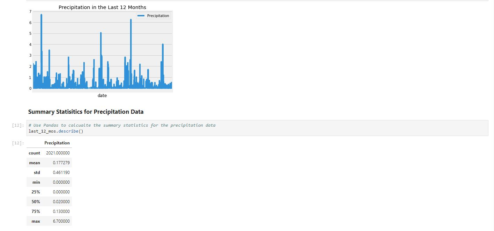
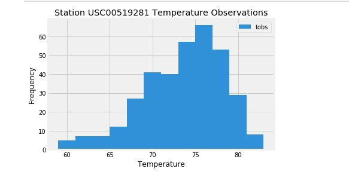

# SQLAlchemy-Challenge
It’s time for a vacation! I have planned a trip to Honolulu, Hawaii. To help plan my trip, I am going to conduct some climate analysis in the area. Once I complete my data exploration and analysis, I will design a Flask API based on the results of my analysis. I will be exploring an [SQLite climate database](https://github.com/AlexandraOricchio/SQLAlchemy-Challenge/blob/master/Resources/hawaii.sqlite) using Python and SQLAlchemy. I will then conduct my analysis utilizing SQLAlchemy ORM queries, Pandas, and Matplotlib. 

## Climate Analysis and Exploration: 
Used SQLAlchemy to connect to the SQLite database. Explored precipitation data and analyzed last 12 months of data. Created a plot to visualize the precipitation values over the 12-month period and retrieved a statistics summary of the data using Pandas. 

Explored station data and designed a query to find the most active stations. Created a histogram plot for the station with the highest number of temperature observations.

